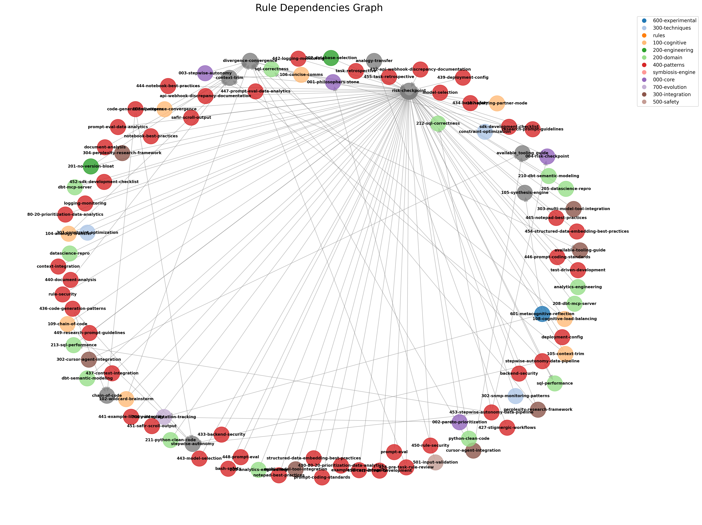

# Cursor Rules Documentation

Total Rules: 111

## Categories

- [000-core](categories/000-core.md) (4 rules)
- [100-cognitive](categories/100-cognitive.md) (9 rules)
- [200-domain](categories/200-domain.md) (22 rules)
- [200-engineering](categories/200-engineering.md) (2 rules)
- [300-integration](categories/300-integration.md) (8 rules)
- [300-techniques](categories/300-techniques.md) (3 rules)
- [400-patterns](categories/400-patterns.md) (56 rules)
- [500-safety](categories/500-safety.md) (1 rules)
- [600-experimental](categories/600-experimental.md) (1 rules)
- [700-evolution](categories/700-evolution.md) (1 rules)
- [rules](categories/rules.md) (2 rules)
- [symbiosis-engine](categories/symbiosis-engine.md) (2 rules)

## Dependencies

## Performance Summary

- **Total Token Budget**: 1,527
- **Average Tokens per Rule**: 13

## Recent Updates

- [101-ultrathink-prompting](rules/101-ultrathink-prompting.md) - 2025-07-07
- [701-rule-adaptation-tracking](rules/701-rule-adaptation-tracking.md) - 2025-01-07
- [601-metacognitive-reflection](rules/601-metacognitive-reflection.md) - 2025-01-07
- [501-input-validation](rules/501-input-validation.md) - 2025-01-07
- [meta-rules-config](rules/meta-rules-config.md) - Unknown
- [rule-config](rules/rule-config.md) - Unknown
- [201-no-version-bloat](rules/201-no-version-bloat.md) - Unknown
- [202-database-selection](rules/202-database-selection.md) - Unknown
- [perplexity-research-framework](rules/perplexity-research-framework.md) - Unknown
- [301-available-tooling-guide](rules/301-available-tooling-guide.md) - Unknown