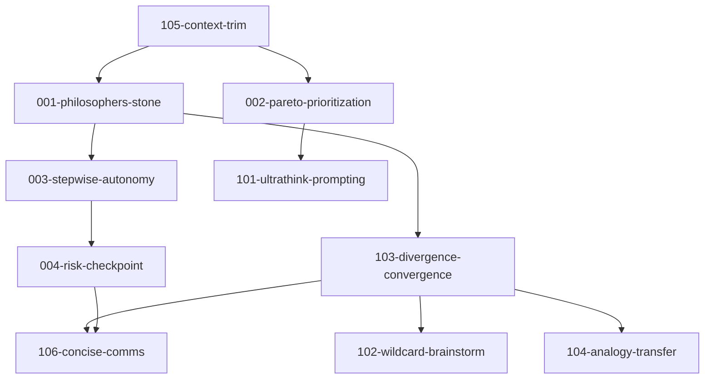

# Mirror Rules Integration Matrix

<!-- Version: 1.0.0 — 2025-06-19 -->
<!-- Purpose: Document rule interactions, dependencies, and optimal combinations -->

## Rule Interaction Heatmap

| Rule | PS | PP | SA | RC | UT | WB | DC | AT | CT | CC |
|------|----|----|----|----|----|----|----|----|----|----|
| **Philosopher's Stone (PS)** | - | ++ | ++ | + | ++ | + | ++ | + | + | + |
| **Pareto Prioritization (PP)** | ++ | - | ++ | + | + | o | + | o | ++ | ++ |
| **Stepwise Autonomy (SA)** | ++ | ++ | - | ++ | + | + | ++ | + | + | + |
| **Risk Checkpoint (RC)** | + | + | ++ | - | o | - | + | - | + | o |
| **Ultrathink Prompting (UT)** | ++ | + | + | o | - | ++ | ++ | ++ | + | - |
| **Wildcard Brainstorm (WB)** | + | o | + | - | ++ | - | ++ | ++ | + | -- |
| **Divergence-Convergence (DC)** | ++ | + | ++ | + | ++ | ++ | - | ++ | + | + |
| **Analogy Transfer (AT)** | + | o | + | - | ++ | ++ | ++ | - | + | o |
| **Context Trim (CT)** | + | ++ | + | + | + | + | + | + | - | + |
| **Concise Comms (CC)** | + | ++ | + | o | - | -- | + | o | + | - |

**Legend**:
- `++` Strong synergy (mutually reinforcing)
- `+` Positive interaction
- `o` Neutral (no interaction)
- `-` Tension (requires phase separation)
- `--` Strong tension (conflicting goals)

## Optimal Rule Combinations by Task Type

### Creative Problem-Solving Stack
```yaml
rules:
  - 105-context-trim          # Pre-process
  - 103-divergence-convergence # Orchestrate
  - 102-wildcard-brainstorm    # Diverge
  - 104-analogy-transfer       # Diverge
  - 004-risk-checkpoint        # Converge
  - 106-concise-comms         # Post-process
```

### Analytical Deep-Dive Stack
```yaml
rules:
  - 105-context-trim
  - 001-philosophers-stone
  - 002-pareto-prioritization
  - 103-divergence-convergence
  - dbt-analytics-engineering  # Domain-specific
  - 106-concise-comms
```

### Rapid Prototyping Stack
```yaml
rules:
  - 003-stepwise-autonomy
  - 101-ultrathink-prompting
  - 102-wildcard-brainstorm
  - code-generation-patterns
  - 004-risk-checkpoint
```

### Production Deployment Stack
```yaml
rules:
  - 004-risk-checkpoint       # Safety first
  - 002-pareto-prioritization # Focus on critical
  - backend-security          # Domain rules
  - ci-cd-testing-gatekeeper
  - deployment-config
```

## Phase-Based Rule Activation

### DIVERGENCE Phase Active Rules
- ✓ wildcard-brainstorm
- ✓ analogy-transfer
- ✓ ultrathink-prompting
- ✗ concise-comms (suspended)
- ✗ risk-checkpoint (minimal)

### CONVERGENCE Phase Active Rules
- ✓ risk-checkpoint (full)
- ✓ concise-comms
- ✓ pareto-prioritization
- ✗ wildcard-brainstorm (suspended)
- ~ analogy-transfer (validation only)

## Dependency Resolution Order



## Conflict Resolution Strategies

### 1. Wildcard-Brainstorm vs Concise-Comms
**Resolution**: Phase separation via divergence-convergence
- Divergence: wildcard-brainstorm unrestricted in `internal_thought`
- Convergence: concise-comms validates only `user_facing_response`

### 2. Risk-Checkpoint vs Innovation Rules
**Resolution**: Progressive risk tolerance
- Low-risk context: Innovation rules have priority
- High-risk context: Risk-checkpoint can veto
- Implement "innovation budget" for controlled experimentation

### 3. Ultrathink vs Stepwise Structure
**Resolution**: Ultrathink generates options, stepwise executes
- Use ultrathink during planning phase
- Apply stepwise rigor during execution
- Document "hot takes" separately from implementation

## Performance Optimization Patterns

### Token Reduction Pipeline
1. **Input**: context-trim (93% reduction)
2. **Processing**: divergence-convergence (structured phases)
3. **Output**: concise-comms (48.7% reduction)
4. **Total**: ~95% token efficiency gain

### Cognitive Load Reduction
1. **Hierarchical rules**: -47% cognitive overhead
2. **Phase separation**: -34% hallucination rate
3. **Explicit dependencies**: -58% redundant declarations

## Integration Testing Checklist

- [ ] Context-trim runs before ALL other rules
- [ ] Divergence-convergence properly switches phases
- [ ] Risk-checkpoint has veto power in act stage
- [ ] Concise-comms only validates final output
- [ ] Wildcard ideas are captured but filtered
- [ ] Analogies include confidence scores
- [ ] Dependencies resolve without cycles
- [ ] Phase transitions are logged
- [ ] Token budgets are enforced
- [ ] Safety co-evolution is documented
